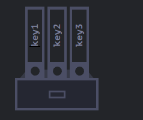
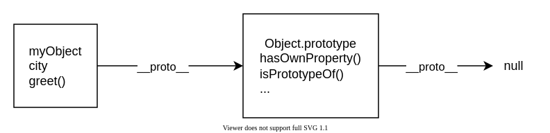

## Variable Declarations
JavaScript'te değişkenleri kullanmak için önce onu oluşturmamız, yani bir değişken bildirmemiz gerekir. Değişkenleri bildirmek için var, let veya const anahtar kelimelerinden birini kullanırız.

#var => var deyimi, işlev kapsamındaki veya global kapsamdaki değişkenleri bildirir ve isteğe bağlı olarak her birini bir değerle başlatır.
```
console.log("var keyword");
{ 
var x = 1; 
}
console.log(x); // globally-scoped expected => 1;

if (x == 1) {
var x = 4; // global x'e yeniden atama yapa biliriz
console.log(x); // expected => 4
}
console.log(x); // expexted => 4;
```


#let => let bildirimi, blok kapsamındaki bir yerel değişkeni bildirir ve isteğe bağlı olarak bir değerle başlatır.
```
console.log("let keyword");
let x = 1;
if (x === 1) {
	let x = 2;
	console.log(x); // Expected output: 2
}
console.log(x); // Expected output: 1
```

#const => Sabitler, let anahtar sözcüğü kullanılarak bildirilen değişkenler gibi blok kapsamlıdır. Bir sabitin değeri yeniden atama yoluyla (yani atama operatörü kullanılarak) değiştirilemez ve yeniden bildirilemez (yani bir değişken bildirimi yoluyla). Ancak, bir sabit bir nesne veya dizi ise, özellikleri veya öğeleri güncellenebilir veya kaldırılabilir.

## Primitive Types
JavaScript'te bir ilkel (ilkel değer, ilkel veri türü), nesne olmayan ve herhangi bir yöntemi veya özelliği olmayan verilerdir. 7 ilkel veri türü vardır:
- [string](https://developer.mozilla.org/en-US/docs/Glossary/String)
- [number](https://developer.mozilla.org/en-US/docs/Glossary/Number)
- [bigint](https://developer.mozilla.org/en-US/docs/Glossary/BigInt)
- [boolean](https://developer.mozilla.org/en-US/docs/Glossary/Boolean)
- [undefined](https://developer.mozilla.org/en-US/docs/Glossary/Undefined)
- [symbol](https://developer.mozilla.org/en-US/docs/Web/JavaScript/Reference/Global_Objects/Symbol)
- [null](https://developer.mozilla.org/en-US/docs/Glossary/Null)

Çoğu zaman, ilkel bir değer doğrudan dil uygulamasının en alt seviyesinde temsil edilir.
## TypeOf Operator
Bir JavaScript değişkeninin veri türünü bulmak için typeOf operatörünü kullanabilirsiniz.

## Object
JavaScript nesnesi, anahtar-değer çiftlerine sahip olmamızı sağlayan bir veri yapısıdır; böylece farklı anahtarlara sahip olabiliriz ve her anahtar, herhangi bir JavaScript veri türünden olabilen bir değerle eşlenir. Gerçek dünyadaki bir nesneyle karşılaştırdığımızda, bir kalem renk, tasarım, yapıldığı malzeme vb. gibi çeşitli özelliklere sahip bir nesnedir. Aynı şekilde, JavaScript nesneleri de özelliklerini tanımlayan özelliklere sahip olabilir. Bir nesne, {...} şekil parantezleri ile isteğe bağlı bir özellik listesi ile oluşturulabilir. Bir özellik bir "anahtar: değer" çiftidir; burada anahtar bir dizedir ("özellik adı" olarak da adlandırılır) ve değer herhangi bir şey olabilir. Bir nesneyi imzalı dosyaları olan bir dolap olarak hayal edebiliriz. Her veri parçası anahtar tarafından kendi dosyasında saklanır. Bir dosyayı ismiyle bulmak veya dosya eklemek/çıkarmak kolaydır.

Bir nesneyi imzalı dosyaları olan bir dolap olarak hayal edebiliriz. Her veri parçası anahtar tarafından kendi dosyasında saklanır. Bir dosyayı ismiyle bulmak veya dosya eklemek/çıkarmak kolaydır.




An empty object (“empty cabinet”) can be created using one of two syntaxes:

```
const emptyObj1 = new Object();
const emptyObj2 = {};
```

##### Computed properties
Bir nesne oluştururken, bir nesne değişmezinde köşeli parantezler kullanabiliriz. Buna hesaplanmış özellikler denir.

```
let fruit = 'apple';
let bag = {
	[fruit + 'Computers']: 5,
};
```

##### Property value shorthand
```
function makeUser(name, age) {
	return {
		name,
		age,
	};
}
```

#### Property names limitations
```
let objName = {
	for: 1,
	let: 4,
	return: 6,
};

console.log(objName.for + objName.let + objName.return);
```


#### Property existence test, “in” operator
```
let objNameDig = {
   0: 1, // same as "0": "test"
};
console.log("0" in objNameDig); // true
console.log("0" in objName); // false
```

#### The "for..in" loop
```
for (let key in user) {
   console.log(key + ": " + user[key]);
}
```

## Prototypes
JavaScript, bir prototip modeli etrafında oluşturulmuş nesne yönelimli bir dildir. JavaScript'te her nesne, eğer varsa, prototipinden özellikleri miras alır. Bir prototip basitçe başka bir nesnenin özelliklerini miras aldığı bir nesnedir. JavaScript kullanarak karmaşık programlar oluşturmak için, prototiplerle çalışma konusunda yetkin olmak gerekir - bunlar dildeki OOP'nin özünü oluşturur.

Prototipler, JavaScript nesnelerinin özelliklerini birbirlerinden miras aldıkları mekanizmadır.

#### The prototype chain
JavaScript'teki her nesnenin prototipi olarak adlandırılan yerleşik bir özelliği vardır. Prototipin kendisi bir nesnedir, bu nedenle prototip kendi prototipine sahip olur ve buna prototip zinciri denir. Zincir, kendi prototipi için null olan bir prototipe ulaştığımızda sona erer.

Bir nesnenin bir özelliğine erişmeye çalıştığınızda: özellik nesnenin kendisinde bulunamazsa, özellik için prototip aranır. Özellik hala bulunamazsa, prototipin prototipi aranır ve bu işlem, özellik bulunana veya zincirin sonuna ulaşılana kadar devam eder; bu durumda tanımsız döndürülür.

Yani myObject.toString() dediğimizde, tarayıcı:
- looks for `toString` in `myObject`
- orada bulamaz, bu yüzden `toString` için `myObject`'in prototip nesnesine bakar
- onu orada bulur ve çağırır.



#### Setting a prototype

###### Using Object.create
Object.create() yöntemi yeni bir nesne oluşturur ve yeni nesnenin prototipi olarak kullanılacak bir nesne belirtmenize olanak tanır.

```
const person = {
	id: 1,
	greet() {
	   console.log("hi");
	}
};
const Carl = Object.create(person);
Carl.type = "human";
Carl.greet(); // hi
console.log(Object.getPrototypeOf(Carl)); // { id: 1, greet: [Function: greet] }
```
Burada bir greet() metodu olan personPrototype nesnesini oluşturuyoruz. Daha sonra prototipi personPrototype olan yeni bir nesne oluşturmak için Object.create() işlevini kullanırız. Artık yeni nesne üzerinde greet() metodunu çağırabiliriz ve prototip bunun uygulanmasını sağlar.

###### Using a constructor
JavaScript'te tüm fonksiyonların prototip adında bir özelliği vardır. Bir fonksiyonu kurucu olarak çağırdığınızda, bu özellik yeni oluşturulan nesnenin prototipi olarak ayarlanır (geleneksel olarak, __proto__ adlı özellikte).

```
const person = {
	greet() {

		console.log(this.name);

	}
};

  

function Carl (name) {
	this.name = name;
}
Object.assign(Carl.prototype, person);
const carl = new Carl("ahmet");
console.log(Object.getPrototypeOf(carl));
console.log(carl)
carl.greet()
```

###### Own properties
Buradaki isim gibi doğrudan nesnede tanımlanan özelliklere kendi özellikleri denir ve bir özelliğin kendi özelliği olup olmadığını statik Object.hasOwn() yöntemini kullanarak kontrol edebilirsiniz:

```
const irma = new Person("Irma");
console.log(Object.hasOwn(irma, "name")); // true
console.log(Object.hasOwn(irma, "greet")); // false
```


